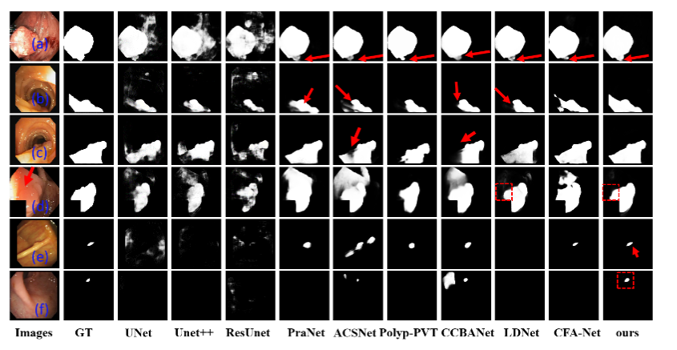

#  GCNet: Global context-guided uncertainty boundary for polyp segmentation


##  Requirements

* torch
* torchvision 
* tqdm
* opencv
* scipy
* skimage
* PIL
* numpy

### 1. Recent Methods
<p align="center">
     <br />
    <em> 
    Figure 1: Overview of the proposed GCNet.
    </em>
</p>

### 2. Framework Overview

<p align="center">
     <br />
    <em> 
    Figure 1: Overview of the proposed GCNet.
    </em>
</p>
<p align="center">
     <br />
    <em> 
    Figure 1: Overview of the proposed GCNet.
    </em>
</p>
<p align="center">
     <br />
    <em> 
    Figure 1: Overview of the proposed GCNet.
    </em>
</p>

### 3. Training

```bash
python train.py  --mode train  --dataset kvasir_SEG  
--train_data_dir /path  --valid_data_dir  /path
```

###  4. Inference

```bash
python test.py  --mode test  --load_ckpt checkpoint 
--dataset kvasir_SEG    --test_data_dir  /path
```
###  5. result
<p align="center">
     <br />
    <em> 
    Figure 2: vison of result.
    </em>
</p>
<p align="center">
     <br />
    <em> 
    Figure 3: vison of edge segmentation.
    </em>
</p>
<p align="center">
     <br />
    <em> 
    Figure 3: vison of edge segmentation.
    </em>
</p>
<p align="center">
     <br />
    <em> 
    Figure 3: vison of edge segmentation.
    </em>
</p>
<p align="center">
     <br />
    <em> 
    Figure 3: vison of edge segmentation.
    </em>
</p>
<p align="center">
     <br />
    <em> 
    Figure 3: vison of edge segmentation.
    </em>
</p>


